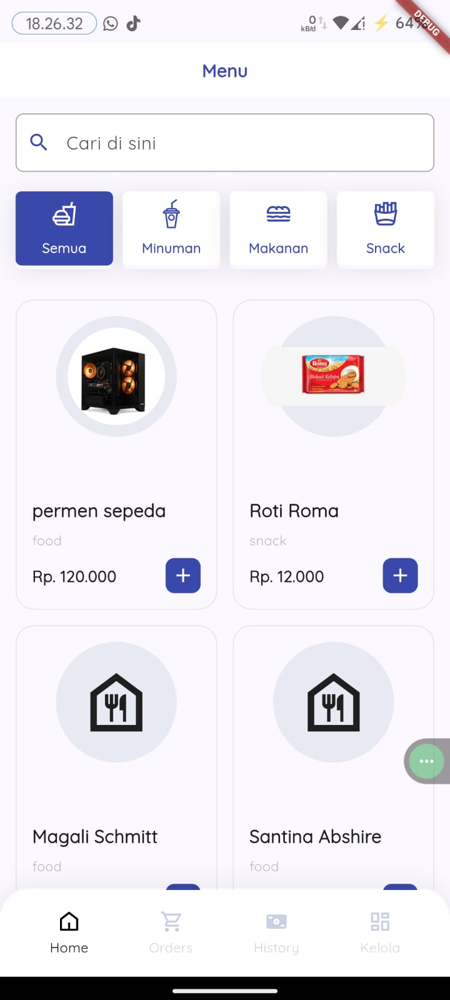
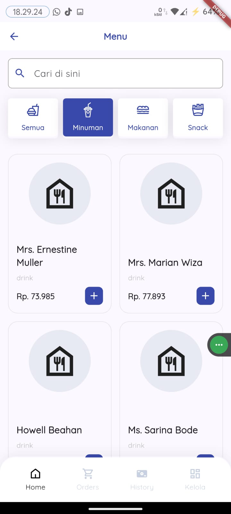
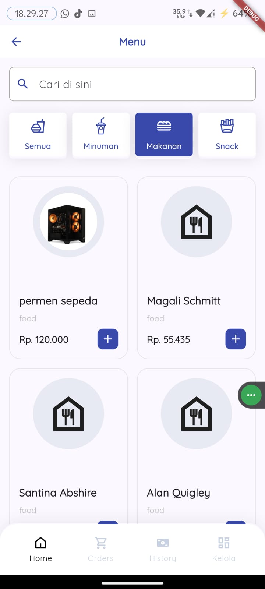
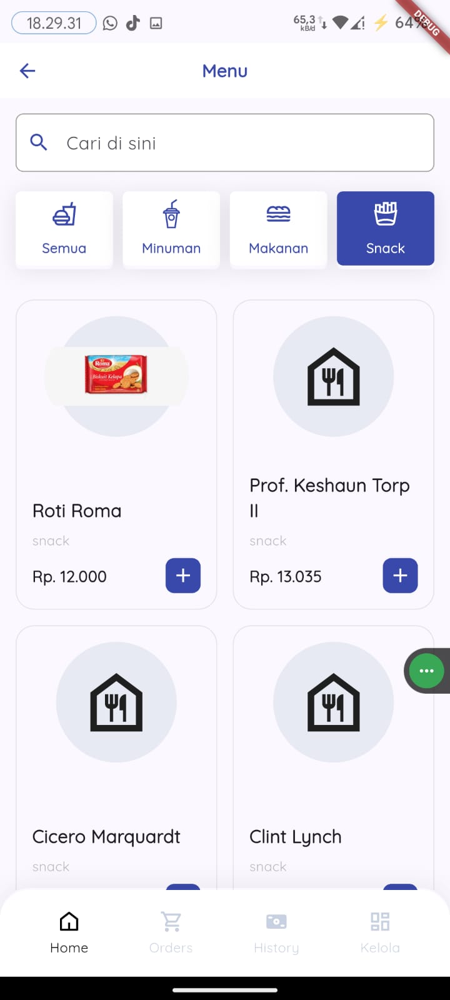
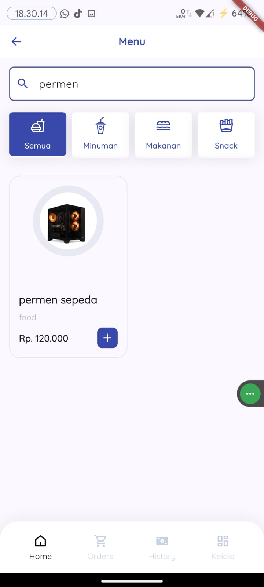
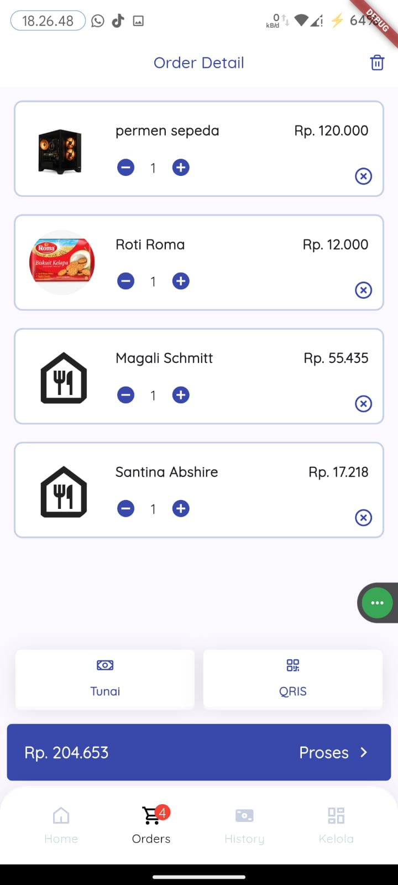
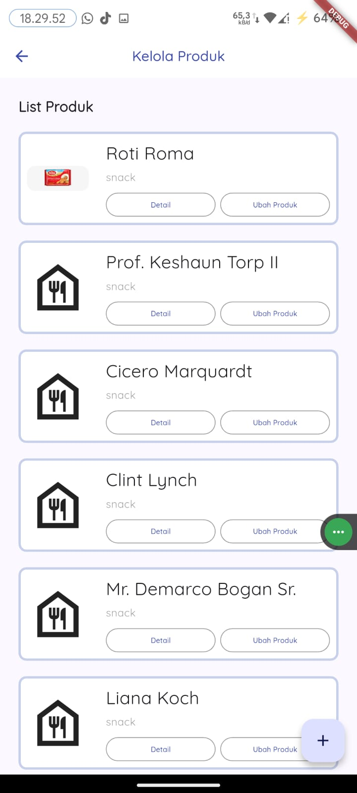
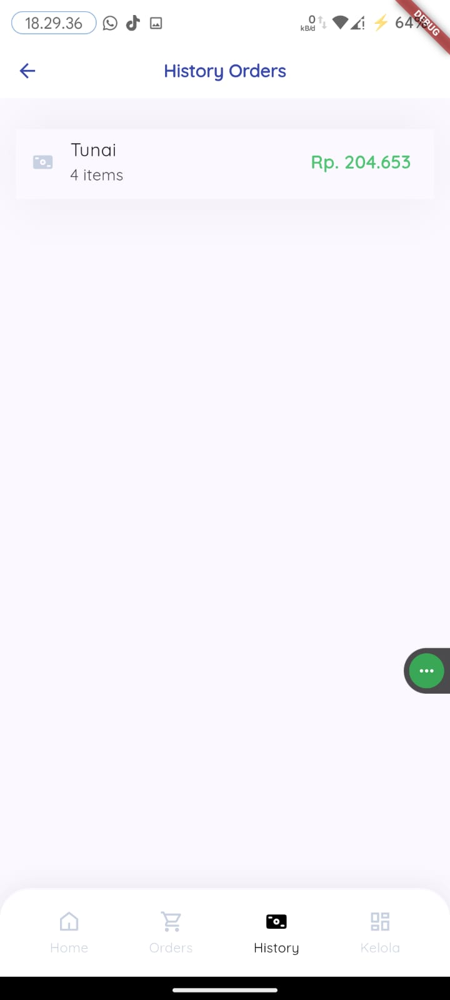
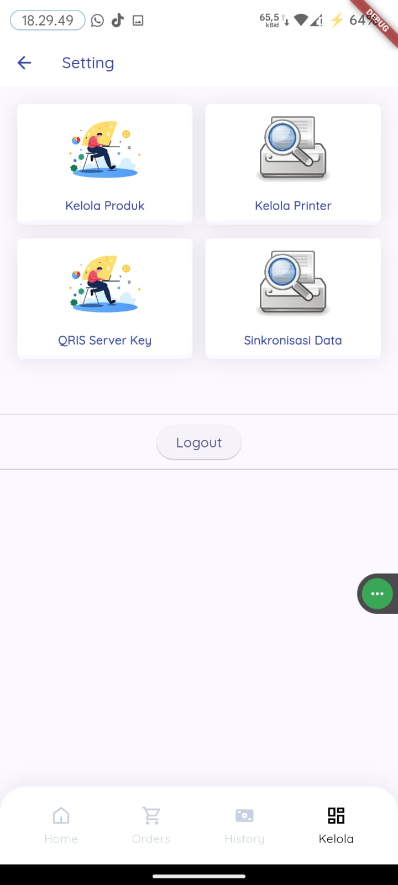

# 📱 Backend Laravel - Flutter Mobile Integration

> **Dokumentasi Bukti Integrasi Backend Laravel dengan Aplikasi Mobile Flutter**

---

## 📋 Daftar Isi

- [Tentang Proyek](#-tentang-proyek)
- [Teknologi yang Digunakan](#-teknologi-yang-digunakan)
- [Fitur yang Terintegrasi](#-fitur-yang-terintegrasi)
- [Screenshot Aplikasi Mobile](#-screenshot-aplikasi-mobile)
- [API Endpoints](#-api-endpoints)
- [Cara Menjalankan](#-cara-menjalankan)

---

## 🎯 Tentang Proyek

Proyek ini merupakan sistem **Point of Sale (POS)** yang terdiri dari:
- **Backend**: Laravel 10 dengan REST API
- **Frontend Mobile**: Flutter
- **Autentikasi**: Laravel Sanctum
- **Database**: MySQL/PostgreSQL

Backend Laravel telah berhasil dikonfigurasi dan terintegrasi dengan aplikasi mobile Flutter, memungkinkan operasi CRUD produk, manajemen order, dan fitur-fitur POS lainnya.

---

## 🛠 Teknologi yang Digunakan

### Backend (Laravel)
- Laravel 10
- Laravel Sanctum (API Authentication)
- MySQL Database
- RESTful API Architecture

### Mobile (Flutter)
- Flutter SDK
- HTTP Package untuk API Integration
- State Management
- Responsive UI Design

---

## ✨ Fitur yang Terintegrasi

### 1. 🏠 Home & Product Management
- ✅ Menampilkan semua produk dari backend
- ✅ Filter produk berdasarkan kategori (Food, Drink, Snack)
- ✅ Real-time data synchronization

### 2. 🔍 Search Product
- ✅ Pencarian produk secara real-time
- ✅ Filter dan sorting produk

### 3. 🛒 Order Management
- ✅ Membuat order baru
- ✅ Menampilkan detail order
- ✅ Sync data order ke server

### 4. 📦 Product Management
- ✅ Kelola produk (Create, Read, Update, Delete)
- ✅ Upload gambar produk
- ✅ Update stock dan harga

### 5. 📊 History & Reports
- ✅ Riwayat transaksi
- ✅ Data order history dari server

### 6. ⚙️ Settings
- ✅ Konfigurasi aplikasi
- ✅ User profile management

---

## 📸 Screenshot Aplikasi Mobile

### 1. Home - Semua Produk

*Tampilan home menampilkan semua produk yang diambil dari backend Laravel*

---

### 2. Home - Filter Kategori Food

*Filter produk berdasarkan kategori Food*

---

### 3. Home - Filter Kategori Drink

*Filter produk berdasarkan kategori Drink*

---

### 4. Home - Filter Kategori Snack

*Filter produk berdasarkan kategori Snack*

---

### 5. Search Product

*Fitur pencarian produk secara real-time dari database*

---

### 6. Order Management

*Halaman order untuk membuat transaksi baru*

---

### 7. Product Management

*Halaman kelola produk dengan fitur CRUD lengkap*

---

### 8. History Transaksi

*Riwayat transaksi yang tersimpan di backend*

---

### 9. Settings

*Halaman pengaturan aplikasi dan user profile*

---

## 🔌 API Endpoints

Backend Laravel menyediakan API endpoints berikut:

### Authentication
```
POST   /api/login          - Login user
POST   /api/logout         - Logout user
POST   /api/update-profile - Update user profile
```

### Products
```
GET    /api/products       - Get all products
POST   /api/products       - Create new product
GET    /api/products/{id}  - Get product detail
PUT    /api/products/{id}  - Update product
DELETE /api/products/{id}  - Delete product
```

### Orders
```
GET    /api/orders         - Get all orders
POST   /api/orders         - Create new order
GET    /api/orders/{id}    - Get order detail
PUT    /api/orders/{id}    - Update order
DELETE /api/orders/{id}    - Delete order
```

> **Note**: Semua endpoint (kecuali login) memerlukan autentikasi menggunakan Laravel Sanctum token.

---

## 🚀 Cara Menjalankan

### Backend Laravel

1. **Clone repository**
   ```bash
   git clone <repository-url>
   cd backendposmobilelaravel
   ```

2. **Install dependencies**
   ```bash
   composer install
   npm install
   ```

3. **Setup environment**
   ```bash
   cp .env.example .env
   php artisan key:generate
   ```

4. **Setup database**
   ```bash
   php artisan migrate
   php artisan db:seed
   ```

5. **Run server**
   ```bash
   php artisan serve --host=0.0.0.0 --port=8000
   npm run dev
   ```

### Mobile Flutter

1. **Setup Flutter project**
   ```bash
   cd <flutter-project-directory>
   flutter pub get
   ```

2. **Konfigurasi API URL**
   - Update base URL di file konfigurasi Flutter
   - Sesuaikan dengan IP address backend Laravel

3. **Run aplikasi**
   ```bash
   flutter run
   ```

---

## 📝 Catatan Penting

- ✅ Backend Laravel sudah berjalan di `http://0.0.0.0:8000`
- ✅ API sudah terintegrasi dengan aplikasi mobile Flutter
- ✅ Autentikasi menggunakan Laravel Sanctum
- ✅ Database sudah di-seed dengan data dummy
- ✅ Semua fitur CRUD produk dan order berfungsi dengan baik

---

## 👨‍💻 Developer

**Proyek UAS - Mobile Programming**  
Semester 5 - 2026

---

## 📄 License

This project is for educational purposes.

---

**Last Updated**: February 2, 2026
